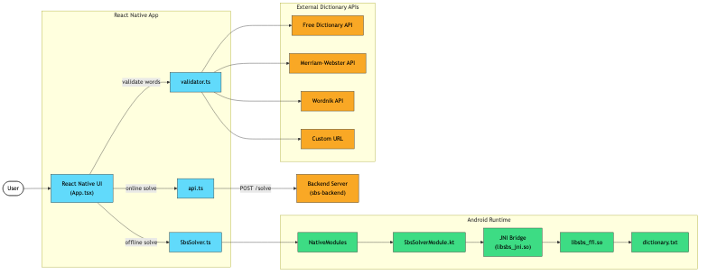

<table>
  <tr>
    <td>
      
    </td>
    <td>
      <p><strong>Spelling Bee Solver</strong>:
      A generalized solver for <a href="https://en.wikipedia.org/wiki/Spelling_bee">Spelling Bee</a> word puzzles.</p>
      <p>Native CLI, web frontend, Android app, Docker &amp; Kubernetes deployment — all powered by a Rust backend.</p>
    </td>
  </tr>
</table>

[](https://github.com/wkusnierczyk/spelling-bee-solver/actions/workflows/backend.yml)
[](https://github.com/wkusnierczyk/spelling-bee-solver/actions/workflows/mobile.yml)
[](https://github.com/wkusnierczyk/spelling-bee-solver/actions/workflows/docker.yml)
[](https://github.com/wkusnierczyk/spelling-bee-solver/actions/workflows/compose.yml)
[](https://github.com/wkusnierczyk/spelling-bee-solver/actions/workflows/minikube.yml)
[](https://github.com/wkusnierczyk/spelling-bee-solver/actions/workflows/gcp.yml)  
[](https://github.com/wkusnierczyk/spelling-bee-solver/releases/latest)
[](https://opensource.org/licenses/MIT)

[Spelling Bee](https://en.wikipedia.org/wiki/Spelling_bee) is a word game where players build a list of valid words from a fixed set of letters, typically with one required center letter and length constraints. Solutions are scored by length, with a bonus for pangrams that use every letter at least once. There are implementations available online, e.g., at [SpellBee.org](https://spellbee.org/) or at [New York Times](https://www.nytimes.com/puzzles/spelling-bee).

This repository does not provide yet another implementation of the puzzle.
It offers a _solver_: a tool for solving Spelling Bee challenges.

The tool _generalizes_ beyond the original NYT puzzle though.

| Constraint        | Solver                                                     | Original puzzle            |
| ----------------- | ---------------------------------------------------------- | -------------------------- |
| Available letters | Any number of letters                                      | Fixed at 7 letters         |
| Required letters  | Any number of required letters, including _zero_ and _all_ | Fixed at 1 required letter |
| Letter repetition | Configurable repetition limits                             | Unbounded repetition       |
| Word length       | Configurable lower and upper bounds                        | Lower bound of 4           |

## Dictionary validation

The solver uses a _seed dictionary_ (a local word list) to generate candidate words.
Optionally, results can be validated against an external dictionary API.
When a validator is enabled:
* Only words confirmed by the external dictionary are retained.
* Each word is enriched with a short definition and a hyperlink to the dictionary entry.

### Supported validators

| Validator | API Key | API Documentation |
| --- | --- | --- |
| [Free Dictionary](https://dictionaryapi.dev/) | Not required | `https://api.dictionaryapi.dev/api/v2/entries/en/{word}` |
| [Merriam-Webster](https://dictionaryapi.com/) | Required (free tier) | `https://dictionaryapi.com/api/v3/references/collegiate/json/{word}?key=KEY` |
| [Wordnik](https://developer.wordnik.com/) | Required (free tier) | `https://api.wordnik.com/v4/word.json/{word}/definitions?api_key=KEY` |
| Custom URL | Not required | User-provided URL (must be Free Dictionary API-compatible) |

### Custom validator

You can provide your own dictionary API URL. The system will probe it (by looking up the word "test") and verify it returns a compatible JSON response. If the probe fails, an error is reported and the custom URL is not used.

## Future features

The Spelling Bee Solver simply lists all the generated words in the GUI.
A future release will allow the user to download those words as a text file.

The Spelling Bee Solver frontend talks to the backend via a RESTful API.
A future release may expose the API publicly, to make interaction with the frontend an optional convenience.

> **Note**  
> The tool was built as a **proof of concept**, a **BWYN** (build what you need) tool for educational purposes, and as an exercise in building and deploying such tools.
> Running a service on the cloud implies non-negligible costs. 
> Deploying further extensions and making the tool available 24/7 depends on external funding. 
> See _Sponsor this project_ ([patreon](https://www.patreon.com/c/wkusnierczyk), [buymeacoffee](https://buymeacoffee.com/wkusnierczyk)).


## Contents

- [Dictionary validation](#dictionary-validation)
  - [Supported validators](#supported-validators)
  - [Custom validator](#custom-validator)
- [Deployment options](#deployment-options)
  - [Using the Rust library](#using-the-rust-library)
  - [Using the FFI library](#using-the-ffi-library)
  - [Building for Android](#building-for-android)
  - [React Native mobile app](#react-native-mobile-app)
    - [Building a standalone APK](#building-a-standalone-apk)
    - [Installing on a device](#installing-on-a-device)
    - [Running on an emulator](#running-on-an-emulator)
  - [Using the CLI](#using-the-cli)
  - [Local native deployment](#local-native-deployment)
  - [Local deployment with Docker](#local-deployment-with-docker)
  - [Local deployment with Docker Compose](#local-deployment-with-docker-compose)
  - [Local deployment with Kubernetes and Minikube](#local-deployment-with-kubernetes-and-minikube)
  - [Cloud deployment (GCP)](#cloud-deployment-gcp)
    - [Cloud cost management](#cloud-cost-management)
- [Development](#development)
  - [Project structure](#project-structure)
  - [Workflows](#workflows)
  - [Code health](#code-health)
- [About](#about)

## Deployment options

The tool can be used as:

* A rust library, that can be used in client rust code.
* A C-compatible FFI library (`sbs-ffi`), for embedding in mobile apps and other non-Rust environments.
* A React Native Android app (`sbs-mobile`), with offline FFI solving and optional online validation.
* A CLI (command-line interface) tool that can be installed on a local machine and executed in the terminal.
* A locally deployed backend and frontend GUI.
* A locally deployed Docker compose cluster.
* A local k8s (kubernetes) cluster, deployed with minikube.
* A cloud service, deployed to GCP (Google Cloud Platform).

### Using the Rust library

Add the library as a local dependency from this repo:

```toml
[dependencies]
sbs = { path = "sbs-backend" }
```

Minimal example:

```rust
use sbs::{Config, Dictionary, Solver};

fn main() -> Result<(), Box<dyn std::error::Error>> {
    let config = Config::new()
        .with_letters("abcdefg")
        .with_present("a");

    let dictionary = Dictionary::from_words(&[
        "face", "cafe", "bead", "feed", "decaf", "badge",
    ]);

    let solver = Solver::new(config);
    let solutions = solver.solve(&dictionary)?;

    println!("{} words", solutions.len());
    Ok(())
}
```

### Using the FFI library

The `sbs-ffi` crate provides a C-compatible dynamic library (`cdylib`) for embedding the solver in non-Rust environments such as Android (via JNI), iOS, or any language with C FFI support.

The library exposes five functions:

| Function | Description |
| --- | --- |
| `sbs_load_dictionary(path) → *mut Dictionary` | Load a dictionary file; returns opaque pointer (or null on failure) |
| `sbs_free_dictionary(ptr)` | Free a dictionary pointer (null-safe) |
| `sbs_solve(dict, json) → *mut c_char` | Solve a puzzle; accepts JSON, returns JSON |
| `sbs_free_string(s)` | Free a string returned by `sbs_solve` (null-safe) |
| `sbs_version() → *const c_char` | Return the library version (static, do not free) |

**Request format** (JSON):

```json
{"letters": "abcdefg", "present": "a"}
```

**Response format** (JSON):

```json
{"words": ["bead", "cafe", "face", ...]}
```

On error, the response contains an `"error"` key instead of `"words"`.

Build the FFI library:

```bash
cd sbs-ffi && cargo build --release
```

The shared library will be at `sbs-ffi/target/release/libsbs_ffi.dylib` (macOS), `.so` (Linux), or `.dll` (Windows).

**Security notes:**

* JSON input is limited to 1 MiB to prevent excessive memory allocation.
* All pointer arguments are null-checked before use.
* The dictionary pointer is opaque — the caller must not inspect or modify its contents.
* Callers must respect the ownership contract: free each pointer exactly once with the matching free function.

### Building for Android

Cross-compile `sbs-ffi` for Android targets (arm64, x86_64, armv7) using `cargo-ndk`.

One-time setup:

```bash
make setup-android
```

This installs the required Rust targets and `cargo-ndk`. An Android NDK must be installed separately (e.g., via Android Studio).

Build:

```bash
make build-android
```

This produces shared libraries in `sbs-mobile/android/app/src/main/jniLibs/` for each ABI, ready for use by an Android project via JNI.

Clean:

```bash
make clean-android
```

### React Native mobile app

A React Native Android app that uses the FFI library for offline solving and optionally connects to the backend for online validation.

#### Prerequisites

Install these manually before running any `make` targets.

**1. Java Development Kit (JDK 17)**

Gradle requires JDK 17. Install it using your platform's package manager or download from [Adoptium](https://adoptium.net/).

| Platform | Install command |
| --- | --- |
| macOS (Homebrew) | `brew install --cask temurin@17` |
| Linux (apt) | `sudo apt install openjdk-17-jdk` |
| Linux (dnf) | `sudo dnf install java-17-openjdk-devel` |
| Windows (winget) | `winget install EclipseAdoptium.Temurin.17.JDK` |
| Windows (Chocolatey) | `choco install temurin17` |

Verify:

```bash
java -version   # should show 17.x
```

Set `JAVA_HOME` if not already configured:

| Platform | Typical path |
| --- | --- |
| macOS | `/Library/Java/JavaVirtualMachines/temurin-17.jdk/Contents/Home` |
| Linux | `/usr/lib/jvm/java-17-openjdk-amd64` |
| Windows | `C:\Program Files\Eclipse Adoptium\jdk-17...` |

**2. Android Studio and SDK**

Install [Android Studio](https://developer.android.com/studio). During setup, ensure the following are installed (available via Settings → Languages & Frameworks → Android SDK):

* **SDK tab:**
  * Android SDK Platform API 34 (or later)
  * Android SDK Platform API 24 (minimum target)
* **SDK Tools tab** (check "Show Package Details"):
  * Android SDK Build-Tools (latest)
  * Android SDK Command-line Tools (latest)
  * Android SDK Platform-Tools
  * Android Emulator
  * NDK 27.1.12297006 — required for Rust cross-compilation via `cargo-ndk`
  * NDK 29.x — required for Gradle/CMake app build (installed by default with current Android Studio)

> **Note**
> Two NDK versions are needed because `cargo-ndk` does not yet support NDK 29.
> Both versions coexist under `$ANDROID_HOME/ndk/`.

**3. Node.js 20+**

Install from [nodejs.org](https://nodejs.org/) or via a version manager ([nvm](https://github.com/nvm-sh/nvm), [fnm](https://github.com/Schniz/fnm)).

```bash
node --version   # should show v20.x or later
```

**4. Rust toolchain**

Install from [rustup.rs](https://rustup.rs/):

```bash
curl --proto '=https' --tlsv1.2 -sSf https://sh.rustup.rs | sh
```

On Windows, use the [rustup-init.exe](https://rustup.rs/) installer instead.

#### Environment variables

Set `ANDROID_HOME` in your `.env` file (loaded automatically by the Makefile):

| Platform | Typical `ANDROID_HOME` path |
| --- | --- |
| macOS | `$(HOME)/Library/Android/sdk` |
| Linux | `$(HOME)/Android/Sdk` |
| Windows | `%LOCALAPPDATA%\Android\Sdk` |

```bash
# .env (macOS example)
ANDROID_HOME=$(HOME)/Library/Android/sdk
```

See `.env.template` for reference.

Verify the SDK is reachable:

```bash
$ANDROID_HOME/platform-tools/adb version
$ANDROID_HOME/cmdline-tools/latest/bin/sdkmanager --version
```

> **Tip**
> Add `$ANDROID_HOME/platform-tools` and `$ANDROID_HOME/cmdline-tools/latest/bin` to your `PATH` so `adb`, `emulator`, and `sdkmanager` are available directly.

#### Setup

```bash
# Install Rust Android targets, cargo-ndk, and npm packages
make setup-mobile
```

This runs `make setup-android` (Rust targets + `cargo-ndk`) followed by `npm install` in `sbs-mobile/`.

#### Build and run

```bash
# Cross-compile FFI library and build the Android debug APK
make check-mobile

# Or run each step separately:
make build-android    # cross-compile libsbs_ffi.so for arm64-v8a, x86_64, armeabi-v7a
make build-mobile     # gradle assembleDebug

# Run on a connected device or emulator
make run-mobile

# Run unit tests
make test-mobile

# Clean build artifacts
make clean-mobile
make clean-android
```

#### Building a standalone APK

The default debug APK requires a running Metro bundler to load the JavaScript bundle. To build a self-contained APK with the JS bundle embedded (no Metro needed):

```bash
mkdir -p sbs-mobile/android/app/src/main/assets

cd sbs-mobile && npx react-native bundle --platform android --dev false --entry-file index.js --bundle-output android/app/src/main/assets/index.android.bundle --assets-dest android/app/src/main/res

cd android && ./gradlew assembleDebug
```

The APK at `sbs-mobile/android/app/build/outputs/apk/debug/app-debug.apk` now works without a development server. This is the recommended approach for wireless deployment and for sharing the APK with others.

> **Note**
> `make run-mobile` starts Metro and deploys in one step, which works well over USB. For wireless ADB, `adb reverse` is not supported, so the standalone APK approach above is more reliable. Alternatively, set the Metro host to your machine's IP on the device: shake → Settings → Debug server host & port for device → enter `<your-ip>:8081`.

#### Targets summary

| Target | Description |
| --- | --- |
| `setup-mobile` | Install all mobile dependencies (Rust targets, cargo-ndk, npm) |
| `build-android` | Cross-compile `sbs-ffi` for Android ABIs |
| `build-mobile` | Build the Android debug APK |
| `check-mobile` | Run `build-android` + `build-mobile` end-to-end |
| `run-mobile` | Launch the app on a connected device or emulator |
| `test-mobile` | Run mobile unit tests (Jest) |
| `clean-mobile` | Remove Gradle build artifacts |
| `clean-android` | Remove cross-compiled JNI libraries |

#### Installing on a device

**Google Play**

The app will be available on Google Play (planned).

**Sideloading via USB**

1. Enable Developer Options on the device: Settings → About Phone → tap "Build number" 7 times.
2. Enable USB Debugging: Settings → Developer Options → USB Debugging.
3. Connect the device via USB and accept the debugging authorization prompt on the device.
4. Verify the connection:
   ```bash
   adb devices
   # should list your device as "device" (not "unauthorized" or "offline")
   ```
5. Build and install:
   ```bash
   # Option A: build + install + start Metro bundler in one step
   make run-mobile

   # Option B: install a previously built APK directly
   make check-mobile
   adb install sbs-mobile/android/app/build/outputs/apk/debug/app-debug.apk
   ```

**Sideloading via Wi-Fi (wireless ADB)**

Wireless ADB lets you deploy and debug without a USB cable. The device and your development machine must be on the same Wi-Fi network.

*Android 11+ (API 30+) — native wireless debugging:*

1. Enable Developer Options (see above).
2. Enable **Wireless debugging**: Settings → Developer Options → Wireless debugging → toggle on.
3. Tap **Pair device with pairing code**. Note the IP address, port, and pairing code shown on the device.
4. Pair from your machine:
   ```bash
   adb pair <ip>:<pairing-port>
   # Enter the pairing code when prompted
   ```
5. Connect (use the port shown on the main Wireless debugging screen, not the pairing port):
   ```bash
   adb connect <ip>:<port>
   ```
6. Verify:
   ```bash
   adb devices
   # should show <ip>:<port> device
   ```
7. Build and install as usual:
   ```bash
   make run-mobile
   # or
   adb install sbs-mobile/android/app/build/outputs/apk/debug/app-debug.apk
   ```

*Android 10 and below — TCP/IP mode (requires one-time USB connection):*

1. Connect the device via USB and verify with `adb devices`.
2. Switch ADB to TCP/IP mode:
   ```bash
   adb tcpip 5555
   ```
3. Find the device's IP address: Settings → Wi-Fi → tap the connected network → IP address.
4. Disconnect the USB cable, then connect wirelessly:
   ```bash
   adb connect <ip>:5555
   ```
5. Verify with `adb devices` and install as usual.

> **Note**
> Wireless ADB resets on device reboot. Repeat the connect step after restarting the device.

**Sideloading via file transfer**

If ADB is not available, transfer the APK file directly to the device:

1. Build the APK:
   ```bash
   make check-mobile
   ```
2. Transfer `sbs-mobile/android/app/build/outputs/apk/debug/app-debug.apk` to the device (via email, cloud storage, file sharing, etc.).
3. On the device, open the APK file and allow installation from unknown sources when prompted.

#### Running on an emulator

The Android Emulator lets you test without a physical device. The emulator ships with Android Studio and is also available as a standalone command-line tool.

**Creating a virtual device**

*Option A — Android Studio GUI:*

1. Open Android Studio → Device Manager (or Tools → Device Manager).
2. Click **Create Virtual Device**.
3. Choose a hardware profile (e.g., Pixel 7).
4. Select a system image:
   * For Apple Silicon (M1/M2/M3) Macs: choose an **arm64-v8a** image.
   * For Intel Macs, Linux, or Windows: choose an **x86_64** image.
   * API level 24 is the minimum; API 34 is recommended.
5. Finish the wizard. The device appears in the Device Manager.

*Option B — command line (`avdmanager`):*

```bash
# List available system images
sdkmanager --list | grep "system-images"

# Download a system image (example: API 34, Google APIs, x86_64)
sdkmanager "system-images;android-34;google_apis;x86_64"

# Create the AVD
avdmanager create avd \
  --name sbs-test \
  --package "system-images;android-34;google_apis;x86_64" \
  --device "pixel_7"
```

On Apple Silicon Macs, use an `arm64-v8a` image instead:

```bash
sdkmanager "system-images;android-34;google_apis;arm64-v8a"
avdmanager create avd \
  --name sbs-test \
  --package "system-images;android-34;google_apis;arm64-v8a" \
  --device "pixel_7"
```

**Hardware acceleration**

The emulator requires hardware acceleration for acceptable performance.

| Platform | Technology | Setup |
| --- | --- | --- |
| macOS | Apple Hypervisor Framework | Enabled automatically, no action needed. |
| Linux | KVM | `sudo apt install qemu-kvm` (or equivalent), then add your user to the `kvm` group: `sudo usermod -aG kvm $USER` and re-login. Verify with `kvm-ok` or `ls -l /dev/kvm`. |
| Windows | WHPX / Intel HAXM | Enable "Windows Hypervisor Platform" in Windows Features. Alternatively, install Intel HAXM from the Android SDK Manager (Intel CPUs only). Hyper-V must be disabled for HAXM; WHPX works alongside Hyper-V. |

Without hardware acceleration the emulator will fall back to software rendering, which is very slow.

**Launching the emulator**

*From Android Studio:*

Click the play button next to the device in Device Manager.

*From the command line:*

```bash
# List available AVDs
emulator -list-avds

# Launch (replace sbs-test with your AVD name)
emulator -avd sbs-test
```

The `emulator` binary lives at `$ANDROID_HOME/emulator/emulator`. Add `$ANDROID_HOME/emulator` to your `PATH` if the command is not found.

| Platform | Typical emulator path |
| --- | --- |
| macOS | `~/Library/Android/sdk/emulator/emulator` |
| Linux | `~/Android/Sdk/emulator/emulator` |
| Windows | `%LOCALAPPDATA%\Android\Sdk\emulator\emulator.exe` |

**Deploying to the emulator**

Once the emulator is running:

```bash
# Verify the emulator is visible
adb devices
# should show "emulator-5554  device" (or similar)

# Build and run
make run-mobile
```

> **Tip**
> The emulator's loopback address `10.0.2.2` maps to the host machine's `localhost`.
> The default backend URL in the app (`http://10.0.2.2:8080`) connects to a backend running on the host. Start the backend with `make start-backend` if using online mode.

#### App features

* **Offline solving** — solves puzzles locally using the FFI library (no network needed).
* **Online mode** — optionally sends requests to a configurable backend URL; falls back to offline on failure.
* **Dictionary validation** — validates candidate words against an external dictionary API (Free Dictionary, Merriam-Webster, Wordnik, or a custom URL). Validation runs client-side and works in both offline and online modes. Validated words include definitions and dictionary links.
* **Persistent API keys** — Merriam-Webster and Wordnik API keys are stored on-device and loaded automatically when the validator is selected.
* **Input validation** — available letters are deduplicated; the required letter is constrained to one of the available letters; results clear on input change.

### Mobile architecture



The mobile app supports three execution paths:

* **Offline solving** — `SbsSolver.ts` → `NativeModules` → `SbsSolverModule.kt` → JNI → `libsbs_ffi.so` → `dictionary.txt`. No network required.
* **Online solving** — `api.ts` → `POST /solve` to a configurable backend server. Falls back to offline on failure.
* **Client-side validation** — `validator.ts` → external dictionary APIs (Free Dictionary, Merriam-Webster, Wordnik, or a custom URL). Works in both offline and online modes.

### Using the CLI

Build the CLI binary:

```bash
make build-cli
```

Run it from the repo root (debug build):

```bash
./sbs-backend/target/debug/sbs --letters abcdefg --present a
```

Install globally:

```bash
make install-cli
```

Optional flags:

```bash
sbs \
  --letters abcdefg \
  --present a \
  --dictionary sbs-backend/data/dictionary.txt \
  --output /tmp/solutions.txt
```

With word length constraints:

```bash
sbs \
  --letters abcdefg \
  --present a \
  --minimal-word-length 5 \
  --maximal-word-length 8
```

With dictionary validation (results include definitions and URLs):

```bash
sbs \
  --letters abcdefg \
  --present a \
  --validator free-dictionary
```

Validators that require an API key:

```bash
sbs \
  --letters abcdefg \
  --present a \
  --validator merriam-webster \
  --api-key YOUR_KEY
```

Custom validator URL:

```bash
sbs \
  --letters abcdefg \
  --present a \
  --validator custom \
  --validator-url https://your-dictionary-api.example.com/api/v2/entries/en
```

You can also provide a JSON config file and override specific fields via flags:

```json
{
  "letters": "abcdefg",
  "present": "a",
  "dictionary": "sbs-backend/data/dictionary.txt",
  "minimal-word-length": 4
}
```

```bash
sbs --config /path/to/config.json --present a
```

### Local native deployment


Deploy the service natively using the followng make targets.

Build and start the backend and the frontend.

```bash
# Backend:
make build-backend
make start-backend

# Frontend:
make build-frontend
make start-frontend
```

Both components of the service can also be started in one go.

```bash
make start-local

# stop afterwards
make stop-local
```

### Local deployment with Docker


Deploy the service with Docker using the followng make targets.

Build and use backend image.

```bash
# Build, deploy backend
make build-backend-container
make start-backend-container

# Test backend
make test-backend-container

# Stop, clean up backend
make stop-backend-container
make remove-backend-container
```

Build and use frontend image.

```bash
# Build, deploy frontend
make build-frontend-container
make start-frontend-container

# Test frontend (requires a running backend)
make test-frontend-container

# Stop, clean up frontend
make stop-frontend-container
make remove-frontend-container
```

Build and use containerised components in one go.

```bash
# Build and start all containers
make start-docker-stack

# Test the stack
make test-docker-stack

# Stop all containers
make stop-docker-stack

# Remove all containers
make remove-docker-stack
```

### Local deployment with Docker Compose


Deploy the service with Docker Compose using the followng make targets.

```bash
# Start the whole stack
make docker-compose-up

# Stop the whole stack
make docker-compose-down

# Remove containers, images, and build cache for a fresh rebuild
make clean-compose-stack
```

### Local deployment with Kubernetes and Minikube


Deploy the stack to a local Minikube cluster using the followng make targets.

```bash
# Start a local cluster (Docker driver)
make minikube-start

# Build images inside Minikube registry and deploy via Helm
make minikube-deploy

# Verify pods and service connectivity
make minikube-test

# Open the frontend service in your browser
make minikube-url

# Clean up the Helm release (cluster stays running)
make minikube-clean

# Stop or delete the Minikube cluster
make minikube-stop
make minikube-delete
```

### Cloud deployment (GCP)


Deploy the stack to a GCP (Google Cloud Platform) Kubernetes cluster using the followng make targets.

**Note**  
Requires `GCP_PROJECT_ID`, `GCP_CLUSTER_NAME`, and `GCP_ZONE` environment variables to be set to appropriate values.
Check your GCP project for details.

```bash
# Authenticate kubectl with the GKE cluster
make gcp-auth

# Build images for Cloud (Force AMD64 for GKE compatibility)
make gcp-build

# Push images to Google Container Registry
make gcp-push

# Deploy to staging namespace for testing
make gcp-deploy-candidate

# Test the candidate deployment in staging
make gcp-test-candidate

# Promote candidate to production (rolling update)
make gcp-promote-candidate

# Remove the staging deployment
make gcp-cleanup-candidate

# Full deployment pipeline
make gcp-deploy

# Show current deployment status
make gcp-status

# Tail backend logs from production
make gcp-logs-backend

# Tail frontend logs from production
make gcp-logs-frontend

# Rollback to previous production release
make gcp-rollback

# Remove all GCP deployments (DANGEROUS)
make gcp-destroy
```

#### Cloud cost management

To avoid excessive charges when the cloud service is not in use, scale down or stop the cluster.

**Option A: Scale to zero**  
Stops _compute_ costs.  
The Load Balancer remains active (~$18/mo), but CPU/RAM incur no costs.

```bash
# Scale down
make gcp-hibernate

# Scale back up
make gcp-wake
```

**Option B: Full teardown**  
Stops _all_ costs.  
Use for long-term breaks. Removes deployments, ingress, and load balancer.

```bash
# Remove everything
make gcp-destroy

# Redeploy later
make gcp-deploy
```

**Check current state**

```bash
make gcp-status
```


## Development

The project is open source and welcomes contributions.
Use [issues](https://github.com/wkusnierczyk/spelling-bee-solver/issues) and [discussions](https://github.com/wkusnierczyk/spelling-bee-solver/discussions) to provide feedback and contributions.

Use [pull requests](https://github.com/wkusnierczyk/spelling-bee-solver/pulls) to contribute content.
No pushing to `main` is allowed.

After cloning, set up the git hooks:

```bash
make setup-hooks
```

This enables a pre-push hook that runs `make check` (format, lint, test) before each push.

### Project structure

```text
.
|-- .github/              # GitHub workflows and templates
|-- LICENSE
|-- Makefile
|-- README.md
|-- architecture/         # Diagrams
|-- charts/               # Helm charts
|-- infra/                # GKE manifests (Ingress, SSL, certs)
|-- sbs-backend/          # Rust backend & trie engine (Actix-web)
|-- sbs-ffi/              # C-compatible FFI library (cdylib)
|-- sbs-frontend/         # React frontend (Vite + TypeScript)
|-- sbs-mobile/           # React Native Android app
|-- docker-compose.yml    # Full stack Docker compose
|-- target/               # Local build artifacts
`-- ...                   # Other files
```

### Workflows

When developing locally, run the GitHub test and integration workflows locally to speed up debugging in case of failure, and saving the remote from polluting commits.

Prerequisites:

* [act](https://github.com/nektos/act).

```bash
# List available workflows
make ci-list

# Run individual workflows
make ci-backend
make ci-docker
make ci-compose

# Run all workflows
make ci-all
```

### Code health

Use these make targets to maintain clean and healthy code.

```bash
# Print available Makefile targets and a short description; no state changes.
make help

# Run backend unit and integration tests; local only.
make test

# Run clippy linter on backend; local only.
make lint

# Format backend code using rustfmt; local only.
make format

# Run format, lint, and test in sequence; local only.
make check

# Run mobile unit tests (Jest); local only.
make test-mobile
```
---

## About

```bash
sbs --about

sbs: Spelling Bee Solver tool
├─ version:   0.5.0
├─ developer: mailto:waclaw.kusnierczyk@gmail.com
├─ source:    https://github.com/wkusnierczyk/spelling-bee-solver
├─ licence:   MIT https://opensource.org/licenses/MIT
└─ usage:     sbs --help
```
